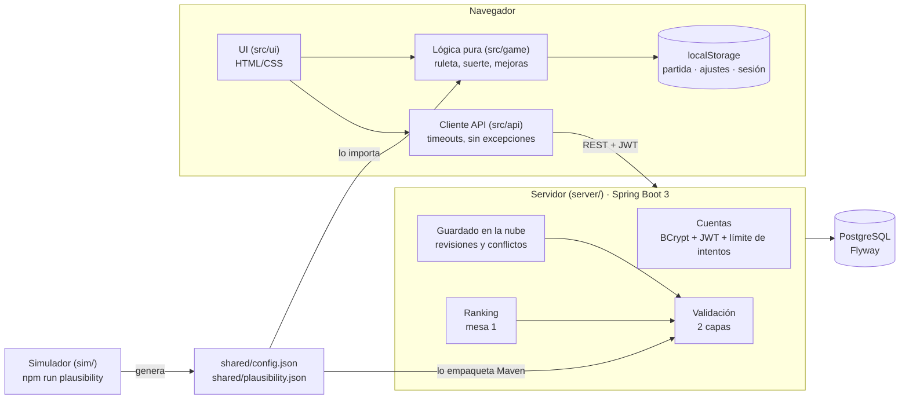

# Casino incremental

Juego incremental de terror en el navegador: un trabajador del casino debe 10.000.000 de fichas y
tiene que saldarlas apostando en una ruleta amañada por la suerte. Frontend en TypeScript que
funciona solo, sin servidor; y un backend opcional en Java/Spring Boot que añade cuentas, guardado
en la nube, ranking y validación de partidas.

El diseño completo está en [GAME_DESIGN.md](GAME_DESIGN.md).

## Arquitectura



- **El juego no depende del servidor.** Se guarda en `localStorage` cada pocos segundos. Si el
  servidor no está o no responde, los botones en línea muestran un aviso y el juego sigue igual.
- **La lógica del juego no se reescribe en Java.** El servidor solo necesita los números del juego
  para validar: los lee de `shared/config.json`, el mismo archivo que importa el frontend. Hay tests
  en los dos lados que fallan si se desincronizan.
- **La validación no re-simula partidas.** Consulta una tabla precalculada por el simulador del juego
  (ver [Validación](#validación-de-plausibilidad)).

```
src/game/    lógica pura (sin DOM): ruleta, suerte, mejoras, ayudante, guardado
src/ui/      interfaz provisional en HTML/CSS
src/api/     cliente HTTP, sesión y lógica de sincronización
sim/         simulador de la mesa 1, informes y generador de la tabla de plausibilidad
shared/      números compartidos por juego y servidor
server/      backend Spring Boot (Java 21, Maven Wrapper)
tests/       tests del frontend (Vitest)
scripts/     pipeline de assets (recorte del fondo, troceado, reescalado nearest neighbor)
assets/      hojas originales (raw/) y sprites generados (sprites/)
```

## Cómo arrancar el proyecto desde cero en otra máquina

Comprobado con un clon limpio (Windows, Git Bash, Node 24, JDK 21+):

```bash
git clone <url-del-repositorio> casino-incremental
cd casino-incremental
npm ci
cp .env.example .env
```

Rellena `.env` (solo hace falta para el backend con Docker: `DB_PASSWORD` y un `JWT_SECRET` de 32+
caracteres, por ejemplo con `openssl rand -base64 48`). Después:

```bash
npm test
npm run dev
```

El juego queda en http://localhost:5173 y funciona sin servidor. Para el servidor opcional sin Docker
(H2 en memoria y el secreto de prueba del perfil `test`, solo para desarrollo), en otra terminal:

```bash
cd server
./mvnw spring-boot:test-run -Dspring-boot.run.profiles=test
```

Tarda ~30 s en responder en http://localhost:8080 (`/api/ranking`). Tests del servidor:
`cd server && ./mvnw test`.

## Cómo arrancarlo

### Frontend (el juego)

Requisitos: Node 20+.

```bash
npm install
```
```bash
npm run dev
```

Se abre en http://localhost:5173. Otros comandos:

| Comando | Qué hace |
|---|---|
| `npm test` | Tests de la lógica, la sincronización y los JSON compartidos |
| `npm run build` | Comprobación de tipos y build de producción en `dist/` |
| `npm run simulate` | Simula miles de partidas de la mesa 1 con varias estrategias e imprime un informe |
| `npm run simulate:slots` | Lo mismo para la mesa 2 (tragaperras), empezando al pagar la mesa 1 (~5 min con 200 partidas) |
| `npm run simulate:dice` | Lo mismo para la mesa 3 (dados), empezando al pagar la mesa 2 (~15 min con 200 partidas; `--no-study` lo acorta) |
| `npm run simulate:cards` | Lo mismo para la mesa 4 (blackjack), empezando al pagar la mesa 3 (~1,5 min con 30 partidas) |
| `npx tsx sim/cardsRig.ts` | Recalibra la baraja de la mesa 4 (`src/game/cards/rigTable.ts`, ~4 min) |
| `npm run plausibility` | Regenera `shared/plausibility.json` completa (`--full`): ~80 s si cambia la mesa 1 (en paralelo, un worker por núcleo), ~3 s si no (caché por mesa en `shared/plausibility-cache.json`) |
| `npm run plausibility:quick` | Versión rápida para desarrollo (200 partidas); el test la rechaza para que se suba la completa |
| `npm run assets` | Regenera los sprites y los fondos de las mesas 1 a 4 en `assets/sprites/` desde las hojas de `assets/raw/` |

El frontend busca el servidor en `http://localhost:8080`. Para cambiarlo, define `VITE_API_URL`.

**Llegar rápido a la mesa 2, 3 o 4 (solo en desarrollo):** abre http://localhost:5173/?dev=mesa4 (o
`?dev=mesa2`, `?dev=mesa3`) y pulsa Continuar. Usa un hueco de guardado aparte
(`casino-incremental-save-dev4`, `-dev2`, `-dev3`) con las mesas anteriores saldadas y todo comprado,
y moneda de prueba; tu partida normal no se toca. En el build de producción
el parámetro no hace nada. Para empezar de cero ese hueco, bórralo desde Ajustes con el parámetro puesto.

### Backend

Requisitos: Java 21 o superior. Maven no hace falta: va incluido el Maven Wrapper (`server/mvnw`).

**Opción A: Docker Compose (Postgres + servidor).**

```bash
cp .env.example .env
```

Rellena `DB_PASSWORD` y `JWT_SECRET` (32+ caracteres; por ejemplo `openssl rand -base64 48`) y arranca:

```bash
docker compose up --build
```

**Opción B: sin Docker, para desarrollo.** Base de datos H2 en memoria, que se borra al parar. Usa la
configuración del perfil de test, que incluye un secreto JWT que solo sirve para pruebas:

```bash
cd server && ./mvnw spring-boot:test-run -Dspring-boot.run.profiles=test
```

**Opción C: con tu propio Postgres.** Define `DB_URL`, `DB_USER`, `DB_PASSWORD` y `JWT_SECRET`, y luego:

```bash
cd server && ./mvnw spring-boot:run
```

Tests del servidor (H2, no necesitan Postgres):

```bash
cd server && ./mvnw test
```

Documentación de la API: http://localhost:8080/swagger-ui.html (OpenAPI en `/v3/api-docs`).

## API

| Método | Ruta | Auth | Qué hace |
|---|---|---|---|
| POST | `/api/auth/register` | — | Crea la cuenta y devuelve un JWT |
| POST | `/api/auth/login` | — | Devuelve un JWT válido 24 h |
| GET | `/api/me` | JWT | Datos del usuario |
| GET | `/api/save` | JWT | Guardado de la nube (404 si no hay) |
| PUT | `/api/save` | JWT | `{baseRevision, data}` → 200, 409 con el guardado del servidor, o 422 |
| POST | `/api/debt-paid` | JWT | Registra la mesa 1 saldada; guarda el mejor resultado |
| GET | `/api/ranking?page=&size=` | — | Ranking paginado, solo resultados verificados |

**Conflictos.** Cada guardado de la nube tiene una revisión que sube con cada escritura. El cliente
recuerda en qué revisión se basa su partida local. Si al subir no coincide con la del servidor,
recibe un 409 con el guardado del servidor, y el jugador elige con cuál se queda. Para sobrescribir,
el cliente reenvía con la revisión del servidor.

## Validación de plausibilidad

El servidor valida cada guardado y cada resultado en dos capas:

**Capa 1: imposible → 422 (se rechaza).** Reglas deterministas a partir de `shared/config.json`:
versión de guardado soportada, tipos y estructura, números finitos y no negativos, niveles de mejora
dentro de su rango, mejoras desconocidas, mejoras del ayudante compradas sin el Crupier, perfil del
ayudante no desbloqueado y tamaño máximo (64 KB).

**Capa 2: implausible → se acepta, pero `verified: false` y fuera del ranking.** El servidor calcula
las fichas que el jugador ha tenido que ganar como mínimo:

```
ganadas_mínimas = saldo + coste exacto de las mejoras compradas + (10M si pagó la deuda)
```

Con eso aplica dos comprobaciones:

1. Si las fichas ganadas superan el máximo plausible para el tiempo de juego del guardado, el
   guardado queda sin verificar. El máximo plausible es el mayor de estos dos valores:
   - **La tabla de `shared/plausibility.json`**: el percentil 99,9 de las fichas ganadas en 2.100
     partidas simuladas con 7 estrategias distintas (de "apostar lo mínimo" a "todo al techo"),
     multiplicado por 2. Hay un valor cada 10 s hasta los 30 minutos, y a partir de ahí se suma el
     ritmo máximo observado (×2).
   - **El límite físico de la basura**: `(6 + t/2) × 500`. Son los objetos iniciales más uno cada
     2 s, todos del valor más alto. Cubre los primeros segundos, en los que la tabla vale casi 0.
2. Si la deuda está pagada con menos tiempo de juego que el mínimo plausible, el guardado queda sin
   verificar. Ese mínimo es la mitad de la partida más rápida que llegó a 10M en esas 2.100
   simulaciones (hoy, 48 s). En la práctica, la comprobación anterior casi siempre salta antes.

¿Por qué no hay un límite "teórico" estricto? Porque casi cualquier cosa es *posible*. Con una
racha de suerte absurda (acertar el número una y otra vez) se llega a 10M en menos de un minuto, y
el juego no limita la velocidad de los clics. Un límite puramente teórico no detectaría nada. Por
eso la capa estadística no rechaza: marca.

La tabla lleva un hash de `shared/config.json`. Si alguien cambia los números del juego y no la
regenera, fallan los tests de los dos lados y el servidor no arranca. Para regenerarla:
`npm run plausibility` (~80 s si cambia la mesa 1; ~3 s si no, gracias a la caché por mesa).

## Decisiones

- **Fuente única de números:** `shared/config.json` (deuda, versión del guardado, costes de las
  mejoras, trabajo). El resto del equilibrio, que el servidor no necesita, sigue en
  `src/game/config.ts`.
- **JWT HS256 sin estado** con el resource server de Spring Security, sin librerías extra de JWT.
  Caduca en 24 h y no hay refresh token.
- **El servidor no arranca** si `JWT_SECRET` falta o tiene menos de 32 caracteres.
- **Límite de intentos** por IP en login y registro (Bucket4j, 10 por minuto por defecto), con 429 y
  `Retry-After`.
- **Login con mensaje genérico** y comparación contra un hash de relleno: no delata qué emails
  existen por el mensaje ni por el tiempo de respuesta. El registro sí dice si un email ya existe,
  como casi todos los servicios.
- **Nombre público** de 3-20 caracteres, único sin distinguir mayúsculas y sin formato de email: el
  ranking nunca muestra emails.
- **Ni contraseñas ni tokens en logs:** los `toString` de peticiones, respuestas y propiedades los
  ocultan, y los errores nunca devuelven el cuerpo de la petición.
- **Un solo hueco de guardado por usuario**, con la fila bloqueada durante la escritura para que dos
  dispositivos no se pisen.
- **Ranking:** se guarda el mejor resultado de cada usuario. Un resultado verificado siempre gana a
  uno sin verificar. Es solo de la mesa 1.
- **Mesas 2 a 4 en el servidor:** el guardado v7 lleva la tragaperras, los dados y el blackjack. El servidor valida
  su estructura, los niveles de sus mejoras, las de su ayudante sin ayudante y que no haya progreso en
  una (ni esté activa) sin la deuda de la anterior pagada. No tienen capa estadística propia ni ranking.

## Limitaciones y trampas

**El ranking no es a prueba de trampas.** Este backend es una demostración de arquitectura, no un
sistema antitrampas:

- **El tiempo de juego lo reporta el cliente.** El servidor no puede saber cuánto has jugado de
  verdad: se fía del `playTime` que llega en el guardado. Quien edite su guardado y declare más
  tiempo tendrá un margen más amplio.
- **Un guardado válido sigue siendo editable dentro de los límites.** Cualquiera puede abrir
  `localStorage` o mandar peticiones a mano con un guardado inventado que pase las dos capas. La
  validación solo descarta lo imposible y lo muy improbable.
- **La tabla estadística sale de jugadores simulados** que apuestan como mucho una vez por segundo.
  Un humano muy rápido, o con mucha suerte, puede quedar "no verificado" sin hacer trampa. Por eso
  esa capa no rechaza.
- **Después de saldar la deuda los márgenes son muy amplios**, porque la economía se dispara (techo
  de 95K y docena con suerte máxima). La validación filtra mucho al principio de la partida y poco
  al final.
- Para un ranking fiable haría falta que el servidor ejecutara la partida (lógica autoritativa) o
  validara la secuencia de acciones con una semilla compartida. Queda fuera del alcance.

**Otras limitaciones:**

- El token JWT se guarda en `localStorage`, así que un fallo de XSS podría robarlo. Mitigado porque
  la interfaz nunca inserta HTML con datos de usuario (los nombres del ranking van con
  `textContent`). No hay refresh token: a las 24 h hay que volver a iniciar sesión.
- El límite de intentos es por IP y en memoria: se reinicia con el servidor, no se comparte entre
  varias instancias, y detrás de un proxy habría que configurar la IP real (`X-Forwarded-For`).
- Sin verificación de email ni recuperación de contraseña.
- Sin progreso offline ni sincronización automática: se sincroniza con el botón.
- No hay despliegue: el `Dockerfile` y el `docker-compose.yml` son para desarrollo local.
- Las mesas 2 a 4 no tienen validación estadística: dentro de los niveles y la estructura válidos, el
  servidor acepta cualquier saldo.
