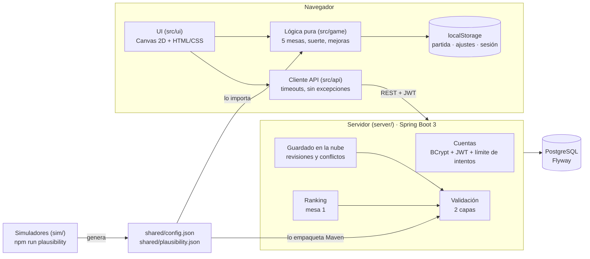

# ROTTEN ODDS

*La casa siempre cobra.*

**Jugar:** https://rottenodds.josemariamerchan.dev · **Modo demo** (todas las mesas sin jugar):
https://rottenodds.josemariamerchan.dev/?demo=mesa1 (también `?demo=mesa2` … `?demo=mesa5` y `?demo=final`).

Juego incremental de terror en el navegador: un trabajador de un casino podrido debe saldar sus deudas mesa a mesa
en **cinco mesas** amañadas por la suerte (ruleta, tragaperras, dados, blackjack y doble o nada), con mejoras,
ayudantes que juegan solos y un final. Frontend en TypeScript sin framework, dibujado en **Canvas 2D** pixel art con
escalado entero, que funciona entero sin servidor; y un backend opcional en Java/Spring Boot que añade cuentas sin
email, guardado en la nube, ranking y validación de partidas.

**Estado del backend:** desplegado en un VPS de Hetzner (Núremberg, Alemania) con Caddy (HTTPS automático) y
PostgreSQL 16 en Docker Compose; la versión publicada del juego ya lo usa para cuentas, guardado en la nube y ranking.
Copia diaria de la base de datos con un temporizador de systemd, guardada 14 días en el mismo servidor (la
restauración se ha probado en local). Pasos en [DEPLOY.md](DEPLOY.md#backend-en-el-vps).

El diseño completo está en [GAME_DESIGN.md](GAME_DESIGN.md); un resumen técnico para el portfolio, con capturas, en
[docs/portfolio/RESUMEN.md](docs/portfolio/RESUMEN.md).

## Arquitectura



- **El juego no depende del servidor.** Se guarda en `localStorage` cada pocos segundos. Si el
  servidor no está o no responde, los botones en línea muestran un aviso y el juego sigue igual.
- **La lógica del juego no se reescribe en Java.** El servidor solo necesita los números del juego
  para validar: los lee de `shared/config.json`, el mismo archivo que importa el frontend. Hay tests
  en los dos lados que fallan si se desincronizan.
- **La validación no re-simula partidas.** Consulta una tabla precalculada por el simulador del juego
  (ver [Validación](#validación-de-plausibilidad)).

```
src/game/    lógica pura (sin DOM) de las cinco mesas: suerte, mejoras, ayudantes, guardado, final
src/ui/      escenas en Canvas 2D (escalado entero) y paneles HTML/CSS por encima
src/api/     cliente HTTP, sesión y lógica de sincronización
sim/         simuladores de las cinco mesas, auditoría de ayudantes y generador de la tabla de plausibilidad
shared/      números compartidos por juego y servidor
server/      backend Spring Boot (Java 21, Maven Wrapper)
tests/       tests del frontend (Vitest)
scripts/     pipeline de assets (recorte del fondo, troceado, reescalado nearest neighbor)
assets/      hojas originales (raw/) y sprites generados (sprites/)
```

## Cómo arrancarlo

Requisitos: Node 20+ para el juego; Java 21+ solo si quieres el servidor (Maven no hace falta: va incluido el
Maven Wrapper, `server/mvnw`). Comprobado con un clon limpio (Windows, Git Bash, Node 24, JDK 21).

### El juego (sin servidor)

```bash
git clone https://github.com/josemerchan712/rottend-odds.git
```

```bash
cd rottend-odds
```

```bash
npm ci
```

```bash
npm test
```

```bash
npm run dev
```

Se abre en http://localhost:5173 y funciona entero sin servidor: sin `VITE_API_URL` se ocultan *Cuenta*
(iniciar sesión y sincronizar) y *Ranking*. No hace falta ningún `.env` para jugar ni para construir.

**Llegar rápido a una mesa (solo en desarrollo):** http://localhost:5173/?dev=mesa2 (hasta `?dev=mesa5`) y pulsa
Continuar. Usa un hueco de guardado aparte (`casino-incremental-save-dev2`…) con las mesas anteriores saldadas y todo
comprado; tu partida normal no se toca. En el build de producción el parámetro no hace nada (allí está el modo demo,
`?demo=mesa1` … `?demo=mesa5` y `?demo=final`).

### Con el servidor en local (opcional)

1. Arranca el servidor de una de estas formas:
   - **Sin Docker** (H2 en memoria, se borra al parar; usa el secreto JWT del perfil de test, que solo sirve para
     pruebas):

     ```bash
     cd server && ./mvnw spring-boot:test-run -Dspring-boot.run.profiles=test
     ```

   - **Con Docker Compose** (PostgreSQL 16 + servidor): copia `.env.example` a `.env`, rellena `DB_PASSWORD` y un
     `JWT_SECRET` de 32+ caracteres (por ejemplo `openssl rand -base64 48`) y arranca:

     ```bash
     docker compose up --build
     ```

   - **Con tu propio PostgreSQL**: define `DB_URL`, `DB_USER`, `DB_PASSWORD` y `JWT_SECRET` y ejecuta
     `cd server && ./mvnw spring-boot:run`.

   Tarda ~30 s en responder en http://localhost:8080 (`/health` o `/api/ranking`).
2. Para que el juego lo use, crea `.env.development.local` con `VITE_API_URL=http://localhost:8080` y vuelve a lanzar
   `npm run dev`. Vite solo lee ese archivo en desarrollo, nunca en `npm run build`.

> **No copies `.env.example` a `.env` para construir la versión publicada.** Vite lee `.env` también al construir:
> si llevara `VITE_API_URL`, el juego publicado apuntaría a `localhost`. En `.env.example` esa línea va comentada;
> el `.env` es solo para el servidor con Docker. La URL de producción se define al construir (ver `DEPLOY.md`).

Tests del servidor (H2, no necesitan PostgreSQL): `cd server && ./mvnw test`. Documentación de la API:
http://localhost:8080/swagger-ui.html (OpenAPI en `/v3/api-docs`); solo en local, en el perfil `prod` están
desactivadas.

### Otros comandos

| Comando | Qué hace |
|---|---|
| `npm test` | Tests de la lógica de las cinco mesas, la interfaz, la sincronización y los JSON compartidos |
| `npm run build` | Comprobación de tipos y build de producción en `dist/` |
| `npm run simulate` | Simula miles de partidas de la mesa 1 con varias estrategias e imprime un informe |
| `npm run simulate:slots` | Lo mismo para la mesa 2 (tragaperras), empezando al pagar la mesa 1 (~5 min con 200 partidas) |
| `npm run simulate:dice` | Lo mismo para la mesa 3 (dados), empezando al pagar la mesa 2 (~15 min con 200 partidas; `--no-study` lo acorta) |
| `npm run simulate:cards` | Lo mismo para la mesa 4 (blackjack), empezando al pagar la mesa 3 (~1,5 min con 30 partidas) |
| `npm run simulate:coin` | Lo mismo para la mesa 5 (doble o nada), empezando al pagar la mesa 4 |
| `npm run audit:helpers` | Auditoría de los ayudantes de las mesas 1 a 4 (cada uno jugando solo) |
| `npx tsx sim/cardsRig.ts` | Recalibra la baraja de la mesa 4 (`src/game/cards/rigTable.ts`, ~4 min) |
| `npm run plausibility` | Regenera `shared/plausibility.json` completa (`--full`): ~80 s si cambia la mesa 1 (en paralelo, un worker por núcleo), ~3 s si no (caché por mesa en `shared/plausibility-cache.json`) |
| `npm run plausibility:quick` | Versión rápida para desarrollo (200 partidas); el test la rechaza para que se suba la completa |
| `npm run assets` | Regenera los sprites y los fondos en `assets/sprites/` desde las hojas de `assets/raw/` |
| `npm run capture:portfolio` | Capturas y fotogramas del vídeo del portfolio (`docs/portfolio/`) |

## API

| Método | Ruta | Auth | Qué hace |
|---|---|---|---|
| POST | `/api/auth/register` | — | Crea la cuenta (nombre de jugador + contraseña) y devuelve un JWT y el código de recuperación (una vez) |
| POST | `/api/auth/login` | — | Devuelve un JWT válido 24 h |
| GET | `/api/auth/name-available?name=` | — | ¿Nombre libre? Si no, por qué y sugerencias |
| POST | `/api/auth/reset` | — | Contraseña nueva con nombre + código de recuperación; devuelve un código nuevo |
| GET | `/api/me` | JWT | Datos del usuario |
| GET | `/health` | — | `{"status":"ok"}` si responde y llega a la base de datos (healthcheck) |
| DELETE | `/api/me` | JWT | Borra la cuenta, el guardado y el ranking |
| GET | `/api/me/export` | JWT | Descarga todos los datos de la cuenta (JSON) |
| GET | `/api/save` | JWT | Guardado de la nube (404 si no hay) |
| PUT | `/api/save` | JWT | `{baseRevision, data}` → 200, 409 con el guardado del servidor, o 422 |
| POST | `/api/debt-paid` | JWT | Registra la mesa 1 saldada; guarda el mejor resultado |
| GET | `/api/ranking?page=&size=` | — | Ranking paginado, solo resultados verificados |

**Conflictos.** Cada guardado de la nube tiene una revisión que sube con cada escritura. El cliente
recuerda en qué revisión se basa su partida local. Si al subir no coincide con la del servidor,
recibe un 409 con el guardado del servidor, y el jugador elige con cuál se queda. Para sobrescribir,
el cliente reenvía con la revisión del servidor.

## Validación de plausibilidad

El servidor valida cada guardado y cada resultado en dos capas:

**Capa 1: imposible → 422 (se rechaza).** Reglas deterministas a partir de `shared/config.json`:
versión de guardado soportada, tipos y estructura, números finitos y no negativos, niveles de mejora
dentro de su rango, mejoras desconocidas, mejoras del ayudante compradas sin el Crupier, perfil del
ayudante no desbloqueado y tamaño máximo (64 KB).

**Capa 2: implausible → se acepta, pero `verified: false` y fuera del ranking.** El servidor calcula
las fichas que el jugador ha tenido que ganar como mínimo:

```
ganadas_mínimas = saldo + coste exacto de las mejoras compradas + (10M si pagó la deuda)
```

Con eso aplica dos comprobaciones:

1. Si las fichas ganadas superan el máximo plausible para el tiempo de juego del guardado, el
   guardado queda sin verificar. El máximo plausible es el mayor de estos dos valores:
   - **La tabla de `shared/plausibility.json`**: el percentil 99,9 de las fichas ganadas en 2.100
     partidas simuladas con 7 estrategias distintas (de "apostar lo mínimo" a "todo al techo"),
     multiplicado por 2. Hay un valor cada 10 s hasta los 30 minutos, y a partir de ahí se suma el
     ritmo máximo observado (×2).
   - **El límite físico de la basura**: `(6 + t/2) × 500`. Son los objetos iniciales más uno cada
     2 s, todos del valor más alto. Cubre los primeros segundos, en los que la tabla vale casi 0.
2. Si la deuda está pagada con menos tiempo de juego que el mínimo plausible, el guardado queda sin
   verificar. Ese mínimo es la mitad de la partida más rápida que llegó a 10M en esas 2.100
   simulaciones (hoy, 48 s). En la práctica, la comprobación anterior casi siempre salta antes.

¿Por qué no hay un límite "teórico" estricto? Porque casi cualquier cosa es *posible*. Con una
racha de suerte absurda (acertar el número una y otra vez) se llega a 10M en menos de un minuto, y
el juego no limita la velocidad de los clics. Un límite puramente teórico no detectaría nada. Por
eso la capa estadística no rechaza: marca.

La tabla lleva un hash de `shared/config.json`. Si alguien cambia los números del juego y no la
regenera, fallan los tests de los dos lados y el servidor no arranca. Para regenerarla:
`npm run plausibility` (~80 s si cambia la mesa 1; ~3 s si no, gracias a la caché por mesa).

## Decisiones

- **Fuente única de números:** `shared/config.json` (deuda, versión del guardado, costes de las
  mejoras, trabajo). El resto del equilibrio, que el servidor no necesita, sigue en
  `src/game/config.ts`.
- **JWT HS256 sin estado** con el resource server de Spring Security, sin librerías extra de JWT.
  Caduca en 24 h y no hay refresh token.
- **El servidor no arranca** si `JWT_SECRET` falta o tiene menos de 32 caracteres.
- **Cuentas sin email:** nombre de jugador + contraseña. El nombre es a la vez el identificador para
  entrar y el nombre público del ranking: 3-20 caracteres (letras ASCII, dígitos, `-` y `_`, sin
  empezar ni acabar con símbolo), único sin distinguir mayúsculas (restricción única en la base de
  datos sobre el nombre en minúsculas) pero mostrado tal como se escribió. No se guarda ningún dato
  de contacto.
- **Nombres reservados y filtro ofensivo** (`PlayerNames.java`): admin, moderador, sistema, el nombre
  del juego, sus personajes… y una lista corta de insultos en español e inglés (con `0→o`, `1→i`… y sin
  separadores). Límites conocidos: es una lista, no un moderador; se escapa con faltas creativas o
  palabras que no están, y para no bloquear palabras normales algunas raíces solo cuentan al principio
  o al final del nombre.
- **Nombre ocupado:** 409 con hasta cinco sugerencias que están libres en ese momento y pasan el filtro
  (números y sufijos `_Deuda`, `_Cero`, `_Casa`…). Dos registros simultáneos con el mismo nombre: la
  restricción única rechaza el segundo y se responde 409, nunca 500.
- **Código de recuperación** de 16 caracteres legibles (sin `0/O` ni `1/I`), que se muestra una sola
  vez y se guarda solo su hash BCrypt. Restablecer con nombre + código invalida ese código y entrega
  uno nuevo. Sin email, es la única forma de recuperar la cuenta.
- **Límite de intentos** por IP (Bucket4j), con 429 y `Retry-After`: login, registro y restablecer
  comparten cubo (10 por minuto por defecto); la consulta de disponibilidad tiene el suyo (30 por
  minuto) para que no sirva para listar usuarios.
- **Login y restablecer con mensaje genérico** y comparación contra un hash de relleno: no delatan qué
  nombres existen por el mensaje ni por el tiempo de respuesta. El registro y la consulta de
  disponibilidad sí dicen si un nombre está ocupado: es inevitable si el nombre es público.
- **Contraseña** de 10 caracteres o más, distinta del nombre, guardada con BCrypt.
- **Ni contraseñas ni tokens en logs:** los `toString` de peticiones, respuestas y propiedades los
  ocultan, y los errores nunca devuelven el cuerpo de la petición.
- **Un solo hueco de guardado por usuario**, con la fila bloqueada durante la escritura para que dos
  dispositivos no se pisen.
- **Ranking:** se guarda el mejor resultado de cada usuario. Un resultado verificado siempre gana a
  uno sin verificar. Es solo de la mesa 1.
- **Mesas 2 a 5 en el servidor:** el guardado (v12) lleva la tragaperras, los dados, el blackjack y el doble o nada. El servidor valida
  su estructura, los niveles de sus mejoras, las de su ayudante sin ayudante y que no haya progreso en
  una (ni esté activa) sin la deuda de la anterior pagada. No tienen capa estadística propia ni ranking.

## Limitaciones y trampas

**El ranking no es a prueba de trampas.** Este backend es una demostración de arquitectura, no un
sistema antitrampas:

- **El tiempo de juego lo reporta el cliente.** El servidor no puede saber cuánto has jugado de
  verdad: se fía del `playTime` que llega en el guardado. Quien edite su guardado y declare más
  tiempo tendrá un margen más amplio.
- **Un guardado válido sigue siendo editable dentro de los límites.** Cualquiera puede abrir
  `localStorage` o mandar peticiones a mano con un guardado inventado que pase las dos capas. La
  validación solo descarta lo imposible y lo muy improbable.
- **La tabla estadística sale de jugadores simulados** que apuestan como mucho una vez por segundo.
  Un humano muy rápido, o con mucha suerte, puede quedar "no verificado" sin hacer trampa. Por eso
  esa capa no rechaza.
- **Después de saldar la deuda los márgenes son muy amplios**, porque la economía se dispara (techo
  de 95K y docena con suerte máxima). La validación filtra mucho al principio de la partida y poco
  al final.
- Para un ranking fiable haría falta que el servidor ejecutara la partida (lógica autoritativa) o
  validara la secuencia de acciones con una semilla compartida. Queda fuera del alcance.

**Otras limitaciones:**

- El token JWT se guarda en `localStorage`, así que un fallo de XSS podría robarlo. Mitigado porque
  la interfaz nunca inserta HTML con datos de usuario (los nombres del ranking van con
  `textContent`). No hay refresh token: a las 24 h hay que volver a iniciar sesión.
- El límite de intentos es por IP y en memoria: se reinicia con el servidor y no se comparte entre
  varias instancias. Detrás de Caddy cuenta la IP real: Tomcat solo acepta `X-Forwarded-For` de la IP fija
  del proxy (`server.tomcat.remoteip.internal-proxies`), así que la cabecera no se puede falsear.
- Sin email no hay recuperación de cuenta si se pierde el código de recuperación: se avisa al crear la
  cuenta y se puede copiar o descargar.
- Sin progreso offline ni sincronización automática: se sincroniza con el botón.
- Las copias de seguridad están en el mismo servidor que la base de datos: protegen de errores y de una mala
  migración, no de perder el servidor. La restauración (`deploy/restore.sh`) se ha probado en local, no en el VPS.
- Las mesas 2 a 5 no tienen validación estadística: dentro de los niveles y la estructura válidos, el
  servidor acepta cualquier saldo.

## Contacto

Problemas, dudas o ejercer los derechos sobre tus datos: [admin@josemariamerchan.dev](mailto:admin@josemariamerchan.dev)
(también desde *Ajustes → Reportar un problema* en el juego).

## Créditos

**ROTTEN ODDS** · diseño, programación y textos: José María Merchán Martos. Arte: pixel art generado con
IA y procesado para el juego (`npm run assets`). Sonido sintetizado en el navegador. Fuente VT323
© 2011 The VT323 Project Authors (Peter Hull), con licencia SIL Open Font License 1.1
(`public/licencias/VT323-OFL.txt`). El título y el subtítulo viven en `src/game/config.ts`
(`GAME_TITLE`, `GAME_TAGLINE`); el paquete npm y el Worker conservan el nombre técnico `casino-incremental`.
